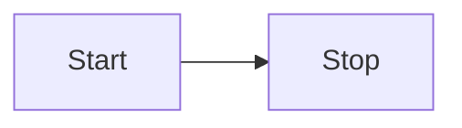

# Algoritma

## Algoritma Deskritif

### Masak Mie

```
1. Mulai
2. Siapkan Mie
3. Masak Air
4. Masukkan Mie
5. Tunggu hingga matang
6. Setelah matang mie dimasukkan ke piring
7. Masukkan bumbu dan di aduk
8. Mie Siap disajikan
9. Selesai
```

## Algoritma Flowchart

### Ganjil Genap


