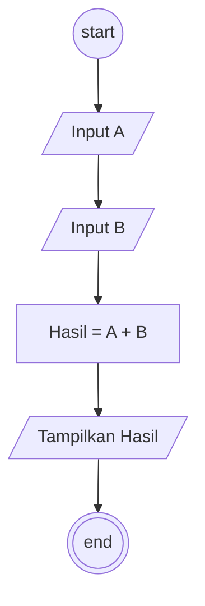

# Algoritma Perhitungan

## Deskritif

```
1. Mulai
2. Masukkan variabel A
3. Masukkan variabel B
4. Hitung Hasil dari A + B
5. Tampilkan Hasil
9. Selesai
```

## Flowchart



## Pseudo-Code

```pseudo-code
DECLARE A : INTEGER

INPUT A

IF A > 10 THEN
    OUTPUT "ANGKA Lebih besar dari 10"
ELSEIF A >= 5 THEN
    OUTPUT "Angka lebih besar dari 5"
Else
    OUTPUT "Angka lebih kecil dari 10"
ENDIF
OUTPUT "Hasil nya adalah ", Hasil
```
