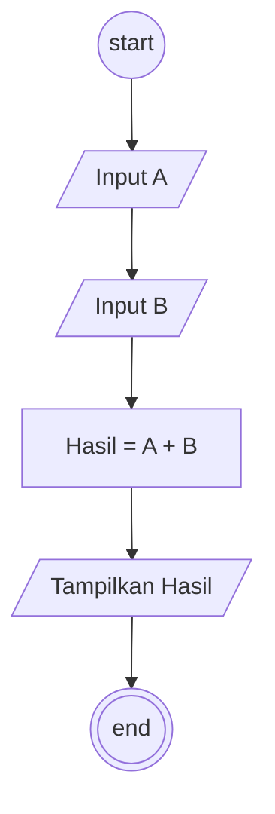

# Algoritma Perhitungan

## Deskritif

```
1. Mulai
2. Masukkan variabel A
3. Masukkan variabel B
4. Hitung Hasil dari A + B
5. Tampilkan Hasil
9. Selesai
```

## Flowchart



## Pseudo-Code

```pseudo-code
DECLARE A : INTEGER
DECLARE B : INTEGER
DECLARE Hasil : INTEGER

INPUT A
INPUT B
Hasil <- A + B

OUTPUT "Hasil nya adalah ", Hasil
```
